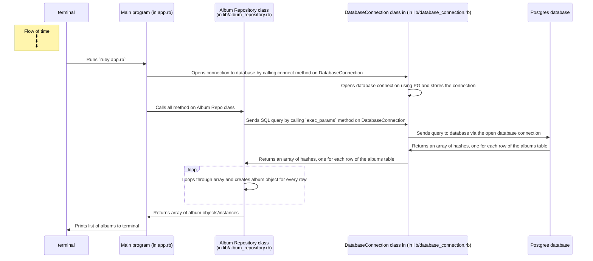

# DATABASES: TEST-DRIVING A REPOSITORY CLASS EXERCISE

----

## Introduction

>In the realm of PostgreSQL, we manipulate tables, column names and records. However, in Ruby programs, we represent data using classes, objects and attributes. We therefore need a way to transform the data retrieved from the database into data that can be used in our program.
>
>To achieve this, you will learn how to build two kind of classes — they're regular Ruby classes, but designed to achieve a specific purpose in our program:
>
> * A **Model class** is used to hold a record's data.
>For example, if we have a table students, we'd have a class Student, with attributes for each column. A single object holds the data for a specific student record. This class usually doesn't contain >any logic, but is only used to hold data.
>
> * A **Repository class** implements methods to run SQL queries on the database to retrieve, create, update or delete data.
>For example, if we have one table students, we'd have a class StudentRepository containing methods that communicates with the database using SQL.

----

## Objective

To learn how to test-drive "Model" and "Repository" classes to `SELECT` records from the database.

For this exercise, I will be creating a Music Library project that will use a "Model" and "Repository" classes.

----

## Sequence diagram for Music Library Project



## Designing a repository class for selecting records from the database

| Method |      Job        | Arguments |   SQL query it executes   |     Returns    |
| ------ | --------------- | --------- | ------------------------- | -------------- |
|  all   | gets all albums |   none    | `SELECT ... FROM albums;` | Array of album |

## How to run it and print out the list of albums in the terminal:

```bash
# in the music-library directory:
$ ruby app.rb
```